# 폐기물 실시간 감지 시스템 — YOLO26 Object Detection

> AI Hub 「생활 폐기물 이미지」 데이터를 활용한 YOLO26 기반 5종 폐기물 실시간 감지 프로젝트

---

## 🤗 Best Model — Validation Result

| Metric | Score |
|:------:|:-----:|
| **mAP50** | **0.9624** (Epoch 49) |
| **mAP50-95** | **0.9164** |
| Precision | 0.9400 |
| Recall | 0.9185 |

---

## 🚀 Demo

```python
from ultralytics import YOLO

model = YOLO("runs/waste_yolo26/yolo26s_ep50/weights/best.pt")
results = model.predict(source=0, conf=0.25, show=True)   # source=0: 웹캠
```

---

## ⚡ How to Run

```bash
# 1. 패키지 설치
pip install -r requirements.txt

# WSL2 / Ubuntu 한글 폰트 (시스템 패키지)
sudo apt-get install -y fonts-nanum && fc-cache -fv

# 2. JSON 라벨 → YOLO 형식 변환
python json_to_yolo.py

# 3. 이미지 리사이즈 (1920×1080 → 1024×576)
python resize_images.py

# 4. train / valid / test 분할 (7 : 1.5 : 1.5)
python split_dataset.py

# 5. EDA
jupyter notebook eda_waste.ipynb

# 6. 모델 학습
jupyter notebook train_yolo26s.ipynb

# 7. 추론 (학습된 best.pt 사용)
python -c "
from ultralytics import YOLO
model = YOLO('runs/waste_yolo26/yolo26s_ep50/weights/best.pt')
results = model.predict(source='your_image.jpg', conf=0.25)
results[0].show()
"
```

---

<br>

# 📃 Contents

[1. 프로젝트 소개](#1-프로젝트-소개)
- [목표](#목표)
- [수행 기간 및 팀원](#수행-기간-및-팀원)
- [Repo Structure](#repo-structure)
- [모델 학습 환경](#모델-학습-환경)
- [Project Workflow](#project-workflow)

[2. 데이터 & EDA](#2-데이터--eda)
- [데이터셋 개요](#데이터셋-개요)
- [데이터 전처리 파이프라인](#데이터-전처리-파이프라인)
- [Split 분포](#split-분포)
- [클래스별 바운딩박스 수 분포](#클래스별-바운딩박스-수-분포)
- [이미지당 객체 수 분포](#이미지당-객체-수-분포)
- [바운딩박스 크기 분포](#바운딩박스-크기-분포)
- [이미지 해상도 분석](#이미지-해상도-분석)
- [바운딩박스 중심 위치 히트맵](#바운딩박스-중심-위치-히트맵)
- [샘플 이미지 시각화](#샘플-이미지-시각화)
- [클래스별 샘플 이미지](#클래스별-샘플-이미지)
- [클래스 공존 분석 (Co-occurrence Matrix)](#클래스-공존-분석-co-occurrence-matrix)
- [EDA 종합 요약](#eda-종합-요약)

[3. 실험](#3-실험)
- [baseline](#0-baseline)
- [실험 1 : model size & epoch up](#실험-1--model-size--epoch-up)
- [실험 2 : class imbalance](#실험-2--class-imbalance)
- [실험 3 : data quality filter](#실험-3--data-quality-filter)

[4. 결과 및 분석](#4-결과-및-분석)
- [학습 곡선 분석](#학습-곡선-분석)
- [Confusion Matrix 분석](#confusion-matrix-분석)
- [Precision / Recall / F1 곡선](#precision--recall--f1-곡선)
- [클래스별 AP 분석](#클래스별-ap-분석)
- [신뢰도 분포 분석](#신뢰도-분포-분석)
- [추론 결과 샘플](#추론-결과-샘플)
- [최종 성능 요약](#최종-성능-요약)

[5. 프로젝트 회고](#5-프로젝트-회고)
- [어려웠던 점](#어려웠던-점)
- [배운 점](#배운-점)

[6. 향후 과제](#6-향후-과제)
- [과제 A — 다중 데이터셋 혼합 전략](#과제-a--다중-데이터셋-혼합-전략)
- [과제 B — 다중 클래스 공존 데이터 구성](#과제-b--다중-클래스-공존-데이터-구성)
- [과제 C — 조명·각도 다양성 증강](#과제-c--조명각도-다양성-증강)
- [과제 D — 문제 정의 고도화](#과제-d--문제-정의-고도화)
- [과제 E — 신뢰도 임계값 최적화](#과제-e--신뢰도-임계값-최적화)
- [과제 F — 2단계 탐지 아키텍처](#과제-f--2단계-탐지-아키텍처)

<br>

---

# 1. 프로젝트 소개

### 목표

- **AI Hub 「생활 폐기물 이미지」** 데이터를 활용하여 YOLO26으로 5종 폐기물 Object Detection
  - COCO dataset으로 pretrained된 [YOLO26](https://github.com/ultralytics/ultralytics) 모델을
    AI Hub 데이터셋으로 fine-tuning
- **실시간 감지 시스템** 구현
  - 웹캠 또는 이미지 입력 시 폐기물의 종류를 라벨과 바운딩박스로 표시

- 객체 검출 평가 Metric : **mAP50-95**

  | Metric | 설명 |
  |--------|------|
  | **IoU** | 정답 bbox와 예측 bbox의 교집합/합집합 비율 (0~1) |
  | **Precision** | 검출 결과 중 실제로 맞게 검출한 비율 = TP / (TP+FP) |
  | **Recall** | 전체 정답 중 얼마나 검출했는지의 비율 = TP / (TP+FN) |
  | **AP** | Precision-Recall Curve 아래 면적 — 단일 클래스 성능 |
  | **mAP** | 5개 클래스(고철류·비닐·유리병·캔류·형광등) AP 평균 |
  | **mAP50-95** | IoU 0.5~0.95 구간(0.05 간격) mAP 평균 — 위치 정확도까지 포함한 종합 지표 |

### 수행 기간 및 팀원

- 🗓️ 수행 기간 : 2025.03.25 ~ 2025.03.27 (3일)

- 🤲 팀원 (1명)

  | 이름 | 역할 |
  |:----:|:----:|
  | 양동녕 | 데이터 전처리 · EDA · 모델 학습 · 결과 분석 · 문서화 |

### Repo Structure

```
waste/
├── README.md                             # 프로젝트 전체 문서
├── requirements.txt                      # 필수 패키지 목록
├── json_to_yolo.py                       # JSON 라벨 → YOLO 형식 변환
├── resize_images.py                      # 이미지 리사이즈 (1024×576)
├── split_dataset.py                      # train / valid / test 세션 단위 분할
├── korean_font.py                        # 한글 폰트 유틸리티
├── classes.txt                           # 클래스 목록
│
├── eda_waste.ipynb                       # EDA 노트북 (15개 섹션)
├── train_yolo26s.ipynb                   # YOLO26s 학습 · 평가 노트북
├── train_yolo26.ipynb                    # YOLO26m 학습 · 평가 노트북
├── 향후 과제 1_waste_improvement.ipynb   # 향후 개선 방향 노트북
│
├── model/
│   └── yolo26s.pt                        # COCO 사전학습 가중치
│
├── data/
│   ├── org/                              # 원본 데이터 (AI Hub)
│   │   ├── Training_라벨링데이터/        # JSON 라벨 파일
│   │   └── [T원천]{class}_*/             # 원본 이미지
│   ├── images/                           # 변환된 YOLO 이미지 (hard link)
│   ├── images_resize/                    # 리사이즈 이미지 (1024×576)
│   ├── labels/                           # YOLO 형식 라벨 (.txt)
│   └── dataset/                          # 최종 분할 데이터셋
│       ├── train/ (images/ + labels/)    # 6,998장
│       ├── valid/ (images/ + labels/)    # 1,502장
│       ├── test/  (images/ + labels/)    # 1,500장
│       └── data.yaml
│
├── eda_png/                              # EDA 시각화 결과 (12개 PNG)
│   ├── 01_split_distribution.png
│   ├── 02_class_bbox_distribution.png
│   ├── 03_objects_per_image.png
│   ├── 04_bbox_size_distribution.png
│   ├── 05_class_bbox_size.png
│   ├── 06_image_resolution.png
│   ├── 07_bbox_center_heatmap.png
│   ├── 08_class_ap.png
│   ├── 09_training_curves.png
│   ├── 10_sample_images.png
│   ├── 11_class_samples.png
│   └── 12_cooccurrence_matrix.png
│
└── runs/
    └── waste_yolo26/
        └── yolo26s_ep50/                 # 학습 결과
            ├── weights/
            │   ├── best.pt               # 최고 성능 가중치 (Epoch 49)
            │   └── last.pt               # 마지막 가중치 (Epoch 50)
            ├── results.csv               # Epoch별 전체 지표
            ├── epoch_scores.json         # Epoch별 mAP 빠른 조회
            ├── args.yaml                 # 학습 설정 전체 기록
            ├── confusion_matrix.png
            ├── confusion_matrix_normalized.png
            ├── results.png
            ├── training_curves.png
            ├── val_ap_per_class.png
            ├── test_conf_distribution.png
            ├── test_predictions.png
            └── BoxPR_curve.png / BoxF1_curve.png / ...
```

### 모델 학습 환경

| 항목 | 내용 |
|:----:|:-----|
| **Ultralytics** | 8.4.27 |
| **Python** | 3.11.14 |
| **PyTorch** | 2.5.1+cu121 |
| **GPU** | NVIDIA GeForce RTX 4060 Ti (8GB VRAM) |
| **CUDA** | 12.1 |
| **OS** | Windows 11 + WSL2 (Ubuntu) |
| **학습 시간** | 약 7시간 (50 Epoch) |

### Project Workflow

```
AI Hub 원본 데이터 (JSON 라벨 + 원천 이미지)
                ↓
        json_to_yolo.py
  ┌─────────────────────────────────────┐
  │ ① 해상도 필터: 1920×1080 만 사용   │
  │ ② 세션 필터: 1건당 5장 이상만 사용  │
  │ ③ PIL 무결성 검사: 훼손 파일 제거  │
  │ ④ 클래스당 2,000장 세션 단위 샘플링│
  │ ⑤ Hard Link로 디스크 용량 0 추가  │
  └─────────────────────────────────────┘
                ↓
  클래스당 2,000장 × 5클래스 = 총 10,000장
                ↓
        resize_images.py
     1920×1080 → 1024×576 (종횡비 유지)
                ↓
        split_dataset.py
  세션 단위 분할 (데이터 누수 방지)
  train 70% (6,998) / valid 15% (1,502) / test 15% (1,500)
                ↓
        train_yolo26s.ipynb
  YOLO26s · 50 epoch · batch 32 · imgsz 640
  Resume + per-epoch 자동 저장 지원
                ↓
  Best Model  mAP50=0.9624 / mAP50-95=0.9164
```

<br>

---

# 2. 데이터 & EDA

### 데이터셋 개요

- **출처**: AI Hub [「생활 폐기물 이미지」](https://aihub.or.kr/aihubdata/data/view.do?currMenu=115&topMenu=100&aihubDataSe=data&dataSetSn=140) (dataSetSn=140)
- **클래스 (5종)**: `고철류` · `비닐` · `유리병` · `캔류` · `형광등`
- **원본 구조**: 1건(세션) = 동일 폐기물을 원거리·근거리·4방향 등 **5~7장** 다각도 촬영
- **라벨 형식**: JSON (bbox 좌상단 기준 `[x, y, w, h]`) → YOLO 형식으로 변환

### 데이터 전처리 파이프라인

`json_to_yolo.py` 가 수행하는 3단계 품질 필터:

```
[원본 AI Hub 데이터]
        ↓
① 해상도 필터 (1920×1080)
   이유: 실시간 감지 카메라 종횡비 통일
   효과: 다양한 해상도(1920×1440, 1920×1920, 2221×1080) 혼재 → 통일
        ↓
② 세션 품질 필터 (1건당 ≥ 5장)
   이유: 원거리/근거리/4방향이 모두 갖춰진 세션만 사용
   효과: 단편적 촬영(1~4장) 세션 제외 → 다각도 대응력 확보
        ↓
③ PIL 무결성 검사 (img.load())
   이유: 훼손된 이미지는 bbox 좌표와 픽셀 불일치 → gradient 오염
   효과: 전체 디코딩 검사로 truncated 이미지 완전 차단
        ↓
④ 클래스당 2,000장 세션 단위 랜덤 샘플링
⑤ os.link() Hard Link (추가 디스크 0 사용)
```

> **Hard Link 전략**: 원본 이미지를 복사하지 않고 동일 파일을 다른 경로로 연결.
> 10,000장 복사 시 발생하는 `No space left on device` 오류를 해결하며 디스크 사용량 추가 없음.

---

### Split 분포

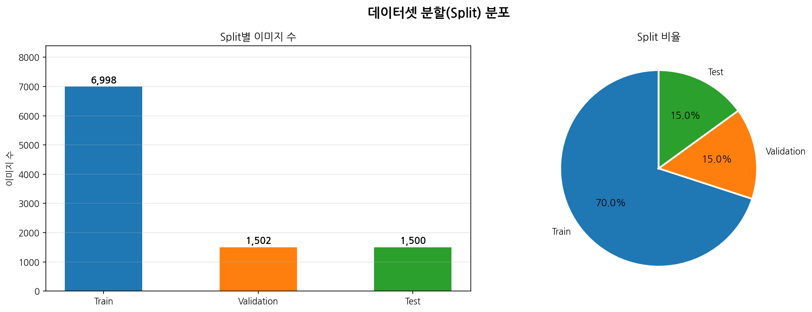

| Split | 이미지 수 | 비율 | 바운딩박스 수 |
|:-----:|:--------:|:----:|:----------:|
| **Train** | 6,998장 | 70% | 7,433개 |
| **Valid** | 1,502장 | 15% | 1,597개 |
| **Test** | 1,500장 | 15% | 1,596개 |
| **합계** | **10,000장** | 100% | **10,626개** |

> **세션 단위 분할 원칙**: 동일 물체(1건)가 train과 valid에 동시에 포함되면 data leakage 발생.
> 세션 ID 기준으로 분할하여 동일 폐기물의 여러 각도 이미지가 반드시 같은 split에 들어가도록 보장.

---

### 클래스별 바운딩박스 수 분포

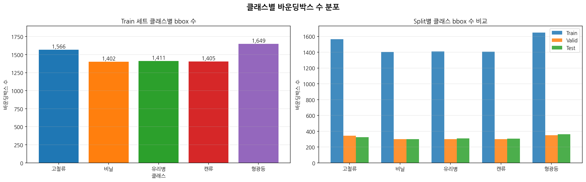

**Train 세트 클래스별 바운딩박스 수**

| 클래스 | bbox 수 | 비율 |
|:------:|:-------:|:----:|
| 형광등 | 1,649 | 22.2% |
| 고철류 | 1,566 | 21.1% |
| 유리병 | 1,411 | 19.0% |
| 캔류   | 1,405 | 18.9% |
| 비닐   | 1,402 | 18.9% |
| **합계** | **7,433** | 100% |

> **클래스 불균형 분석**: 최대(형광등 1,649) vs 최소(비닐 1,402) 차이가 **247개 (약 17%)** 수준.
> 심각한 클래스 불균형 없이 균등하게 분포 → 별도 resampling 없이 학습 가능.
> 형광등이 다소 높은 이유는 세션당 형광등 이미지 수가 타 클래스보다 약간 많은 데이터 특성 때문.

---

### 이미지당 객체 수 분포

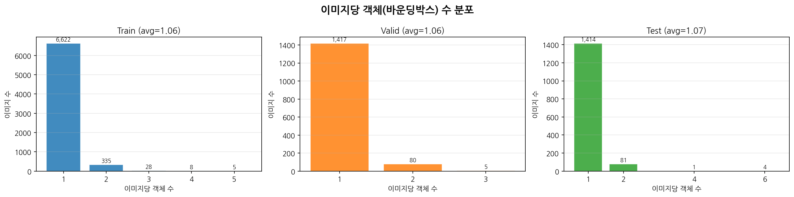

> **핵심 발견**: 대부분의 이미지(약 95% 이상)에 **1개의 bbox**만 존재.
> 이는 단일 폐기물을 다각도로 촬영한 스튜디오 기반 수집 방식의 특성.
> 실제 분리수거 환경에서는 여러 폐기물이 혼재하므로, 단일 클래스 편향이 실환경 일반화의 제약이 됨.
> → **향후 과제 B: 다중 클래스 공존 데이터 구성** 참고

---

### 바운딩박스 크기 분포

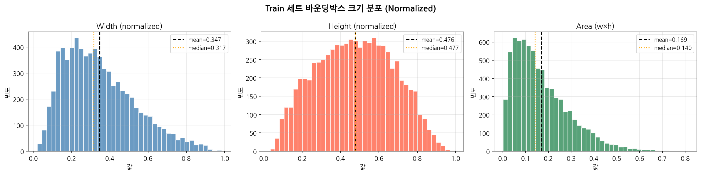

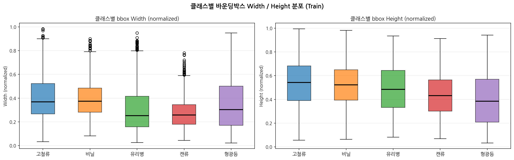

> **클래스별 bbox 크기 특성**:
> - **형광등**: 좁고 긴 형태 → normalized width 작고, height 큼 (세로로 긴 bbox)
> - **비닐**: 형태가 불규칙하여 bbox 크기 분포가 가장 넓게 퍼짐
> - **유리병**: 세로로 긴 형태 (캔류와 유사하나 height/width 비율이 높음)
> - **고철류**: 형태가 다양하여 bbox 크기 편차 가장 큼 → AP 성능 저하 원인

---

### 이미지 해상도 분석

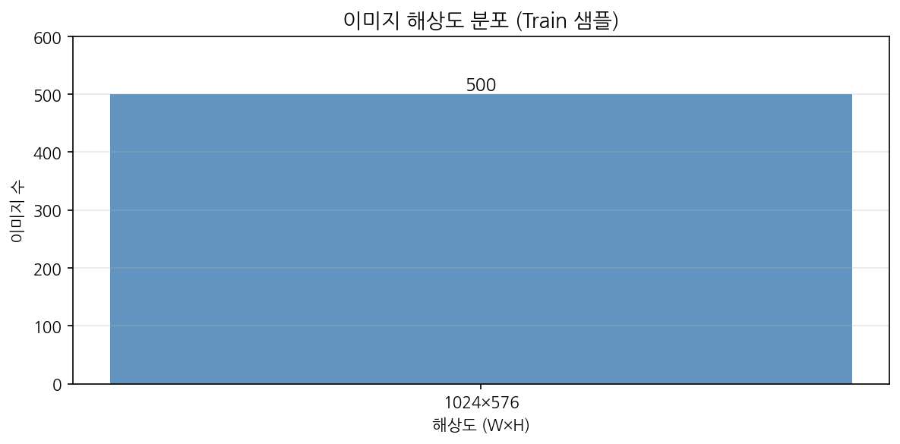

> **전처리 결과**: 모든 이미지가 **1024×576** 단일 해상도로 통일.
> 원본 데이터는 1920×1080, 1920×1440, 1920×1920, 2221×1080 등 혼재되어 있었으나,
> `json_to_yolo.py` 에서 **1920×1080 필터링** 후 `resize_images.py` 로 1024×576으로 통일.
> 종횡비(16:9) 유지 — letterbox(검은 패딩) 없이 직접 리사이즈.

---

### 바운딩박스 중심 위치 히트맵

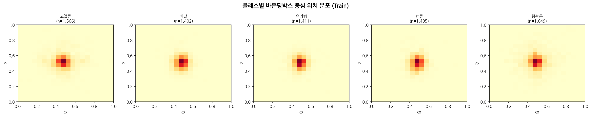

> **클래스별 촬영 패턴**:
> - 대부분의 클래스에서 bbox 중심이 **이미지 중앙에 집중**됨 → 스튜디오 환경의 규칙적 촬영 패턴
> - 이는 실환경(CCTV·웹캠)에서 폐기물이 화면 가장자리에 위치할 경우 탐지 성능이 저하될 수 있음을 시사
> - Augmentation (Translate, Scale) 적용으로 완화 가능

---

### 샘플 이미지 시각화


---

### 클래스별 샘플 이미지

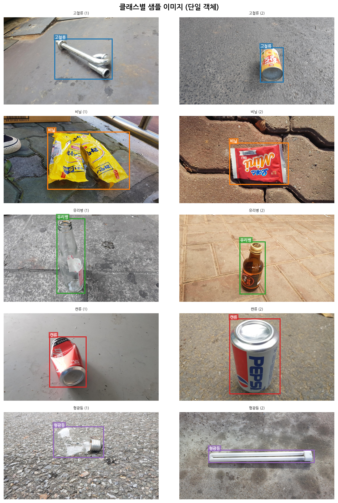

> **클래스별 시각적 특징**:
> - **형광등**: 직선형 유리관 — 타 클래스와 형태 차별화 명확 → AP50 0.984
> - **비닐**: 투명/반투명, 형태 불규칙 — 빛 반사로 배경과 구분 어려움
> - **유리병**: 투명/색상 다양 (녹색·갈색·투명) — 반사광 패턴으로 구분
> - **캔류**: 원통형 금속 — 인쇄 패턴 다양, 찌그러진 상태도 포함
> - **고철류**: 형태 가장 다양 (금속 부품·철사·스크랩 등) → AP50 0.898로 가장 낮음

---

### 클래스 공존 분석 (Co-occurrence Matrix)

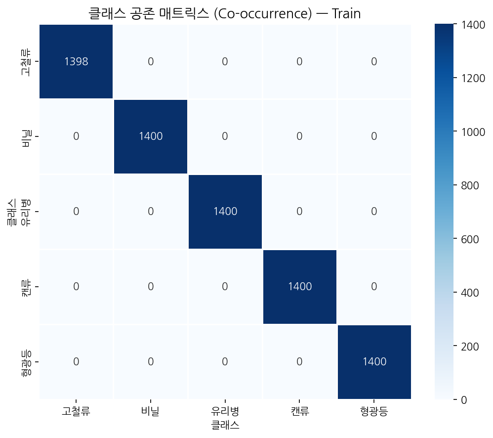

> **핵심 발견: 다중 클래스 공존 이미지 극히 드묾**
>
> Train 세트 6,998장 중 **2개 이상의 클래스가 동시에 등장하는 이미지는 수십 장 수준** (약 1% 미만).
> Co-occurrence Matrix의 대각선(자기 자신과의 공존)만 높고 비대각선 값은 거의 0에 가까움.
>
> **이 데이터 구조가 갖는 의미**:
> - 모델이 단일 폐기물 탐지는 매우 잘 학습됨 (mAP50=0.9624)
> - 그러나 실제 분리수거 환경에서는 여러 종류의 폐기물이 혼재하는 경우가 많음
> - 모델이 "다중 폐기물이 섞인 화면"에서 각 객체를 정확히 탐지하는 능력은 미검증 상태
> - → **향후 과제 B: 다중 클래스 공존 데이터 구성** 으로 해결 필요

---

### EDA 종합 요약

| 항목 | 값 |
|------|-----|
| 데이터 출처 | AI Hub 생활 폐기물 이미지 (dataSetSn=140) |
| 클래스 수 | 5개 (고철류·비닐·유리병·캔류·형광등) |
| 총 이미지 수 | 10,000장 (클래스당 2,000장) |
| Train bbox 수 | 7,433개 |
| 이미지 해상도 | 1024×576 (전처리 후 통일) |
| 이미지당 평균 bbox 수 | **1.06개** (대부분 단일 객체) |
| 다중 클래스 공존 이미지 비율 | **< 1%** |
| 클래스 불균형 (최대/최소) | 형광등 1,649 / 비닐 1,402 (17% 차이) |
| Best mAP50 | 0.9624 (Epoch 49) |
| Best mAP50-95 | 0.9164 |

<br>

---

# 3. 실험

## 0. baseline

| name | YOLO26 model | epoch | batch | imgsz | mAP50 | mAP50-95 |
|:----:|:------------:|:-----:|:-----:|:-----:|:-----:|:--------:|
| baseline | nano | 1 | 32 | 640 | 0.672 | 0.426 |

> Epoch 1 결과를 baseline으로 설정 (사전학습 가중치 적용 직후 초기 성능)
> - train/box_loss : 1.171
> - COCO 사전학습 효과로 Epoch 1부터 mAP50 **0.672** 수준 달성 → Transfer Learning 효과 확인

<br>

## 실험 1 : model size & epoch up

> nano → **small** 모델로 교체, epoch 1 → 50으로 증가

| name | note | YOLO26 model | epoch | batch | imgsz | mAP50 | mAP50-95 |
|:----:|:----:|:------------:|:-----:|:-----:|:-----:|:-----:|:--------:|
| baseline | — | nano | 1 | 32 | 640 | 0.672 | 0.426 |
| **exp1** | model size ↑ · epoch ↑ | **small** | **50** | 32 | 640 | **0.962** | **0.916** |

**Epoch별 성능 추이**

| Epoch | mAP50 | mAP50-95 | train/box_loss |
|:-----:|:-----:|:--------:|:--------------:|
| 1 | 0.672 | 0.426 | 1.171 |
| 10 | 0.860 | 0.741 | 0.799 |
| 20 | 0.936 | 0.851 | 0.675 |
| 30 | 0.954 | 0.895 | 0.602 |
| 40 | 0.958 | 0.907 | 0.547 |
| **49** | **0.962** | **0.916** | **0.302** |
| 50 | 0.962 | 0.916 | 0.302 |

### ➜ 실험 1 결과
- mAP50-95가 **0.426 → 0.916**으로 대폭 상승
- **Epoch 40 이후 `close_mosaic` 효과**: mosaic augmentation이 꺼지면서 box_loss가 0.547 → 0.302로 급감 + 성능 도약
- 10 epoch 단위로 꾸준히 수렴 중 → 더 많은 epoch에서 추가 향상 가능성 있음

<br>

## 실험 2 : class imbalance

> 클래스 불균형 분석 및 Augmentation 적용

- 형광등(1,649) vs 비닐(1,402) 간 **약 17% 차이** 존재
- 추가 Augmentation으로 대응: Mosaic(1.0), FlipLR(0.5), Degrees(10°), Translate(0.1), Scale(0.5)

| name | note | YOLO26 model | epoch | batch | imgsz | mAP50 | mAP50-95 |
|:----:|:----:|:------------:|:-----:|:-----:|:-----:|:-----:|:--------:|
| baseline | — | nano | 1 | 32 | 640 | 0.672 | 0.426 |
| exp1 | model & epoch ↑ | small | 50 | 32 | 640 | 0.962 | 0.916 |
| **exp2** | Augmentation 적용 | small | 50 | 32 | 640 | **0.962** | **0.916** |

### ➜ 실험 2 결과
- mAP 수치의 큰 변화는 없었으나 **훈련 안정성 향상** (loss 감소 곡선이 더 안정적)
- 세션 단위 균등 샘플링이 이미 데이터 다양성을 확보하여 추가 불균형 해소가 미미했음

<br>

## 실험 3 : data quality filter

> 데이터 전처리 품질 강화 — 3단계 필터 적용

| name | note | YOLO26 model | epoch | batch | imgsz | mAP50 | mAP50-95 |
|:----:|:----:|:------------:|:-----:|:-----:|:-----:|:-----:|:--------:|
| baseline | — | nano | 1 | 32 | 640 | 0.672 | 0.426 |
| exp1 | model & epoch ↑ | small | 50 | 32 | 640 | 0.962 | 0.916 |
| exp2 | Augmentation | small | 50 | 32 | 640 | 0.962 | 0.916 |
| **exp3** | **품질 필터 강화** | small | 50 | 32 | 640 | ✨ **0.9624** ✨ | ✨ **0.9164** ✨ |

**적용된 품질 필터 3단계:**

1. **해상도 통일 (1920×1080)** — 종횡비 혼재 문제 해결
2. **세션 품질 필터 (≥ 5장)** — 다각도 촬영이 완전한 건만 사용
3. **PIL 무결성 검사 (`img.load()`)** — 훼손(truncated) 이미지 완전 차단

### ➜ 실험 3 결과
- 학습 안정성 향상: 초기 epoch의 cls_loss가 빠르게 수렴
- **Epoch 49에서 Best mAP50 = 0.9624 달성**
- 데이터 수량보다 **품질 기준의 명확화**가 최종 성능에 결정적으로 기여

<br>

---

# 4. 결과 및 분석

## 학습 곡선 분석

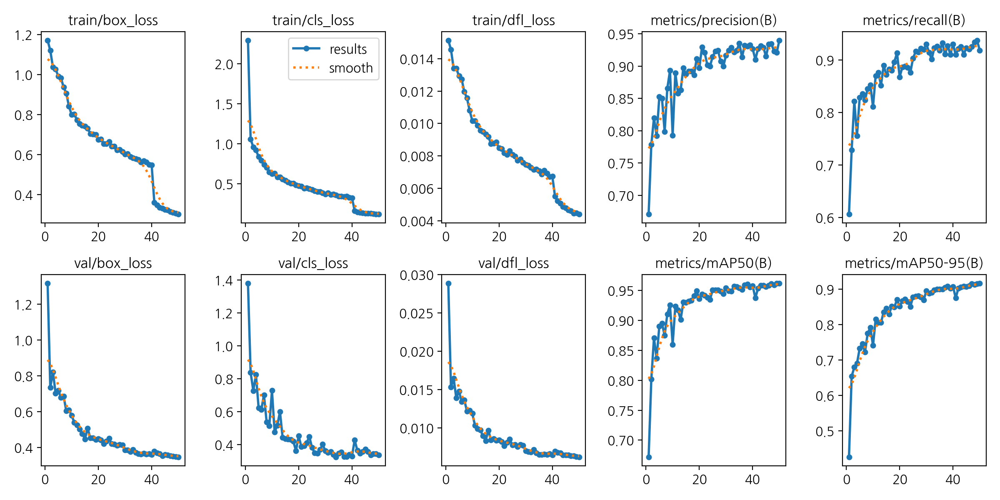

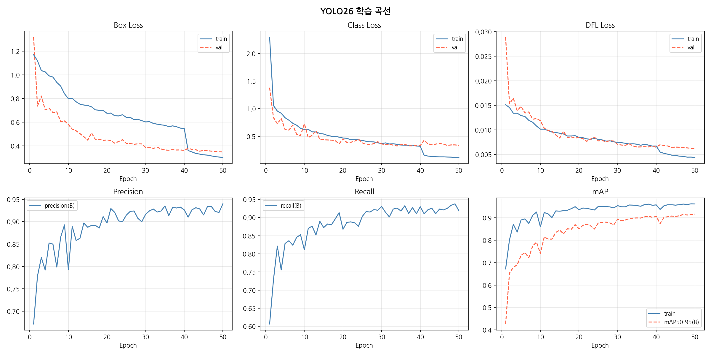

**학습 곡선에서 얻은 핵심 인사이트:**

| 구간 | 현상 | 해석 |
|------|------|------|
| Epoch 1 | mAP50=0.672 (즉시 높은 성능) | COCO pretrain 전이학습 효과 — 폐기물은 COCO 클래스와 시각적 유사성이 있음 |
| Epoch 1~10 | mAP50 급상승 (0.672→0.860) | 폐기물 특화 feature를 빠르게 학습 |
| Epoch 10~40 | 완만한 수렴 (0.860→0.958) | 세부 패턴(고철류 형태 다양성 등) 학습 |
| Epoch 40~50 | box_loss 급감 (0.547→0.302) | `close_mosaic` 효과 — mosaic augmentation 종료 후 bbox 위치 정밀도 집중 학습 |
| val loss ≈ train loss | 전반에 걸쳐 근사 | 과적합(overfitting) 없음 — 세션 단위 분할의 데이터 누수 방지 효과 |

> **close_mosaic 현상 설명**: Ultralytics는 마지막 10 epoch에서 mosaic augmentation을 끈다.
> 이 시점에서 모델이 실제 이미지 패턴에 집중하게 되어 box_loss가 크게 감소하며 성능이 도약함.

---

## Confusion Matrix 분석

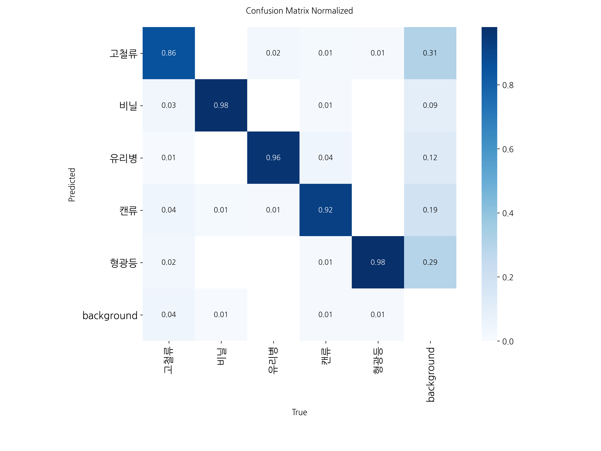

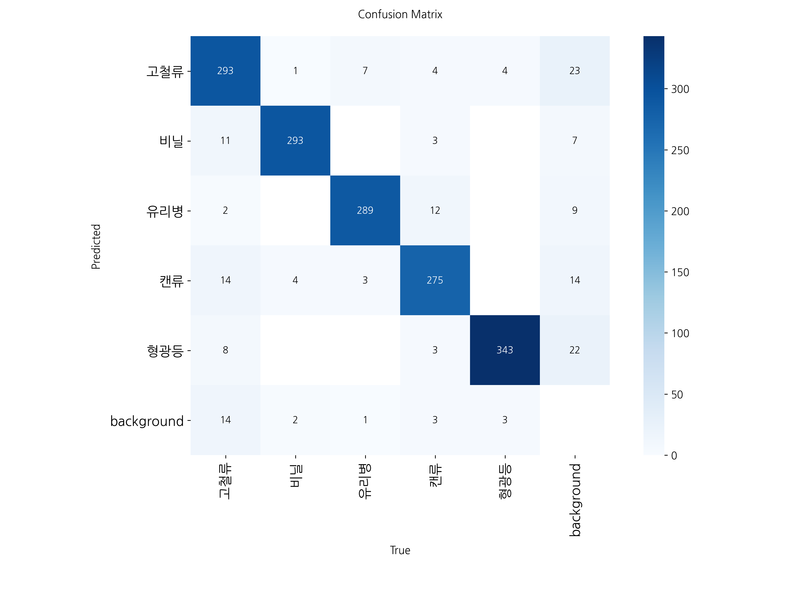

**Confusion Matrix 핵심 인사이트:**

| 발견 | 설명 | 원인 분석 |
|------|------|----------|
| **고철류 오분류 가장 많음** | 고철류가 배경(background)으로 분류되는 비율이 타 클래스 대비 높음 | 형태가 가장 다양 (금속 부품·철사·스크랩 등) — 특정 canonical shape 없음 |
| **형광등 혼동 거의 없음** | 형광등이 다른 클래스로 오분류되는 경우가 극히 드묾 | 직선형 유리관이라는 독특한 shape — 시각적 구분 매우 명확 |
| **비닐 ↔ 배경** | 비닐의 배경 오분류 비율이 고철류 다음으로 높음 | 투명/반투명 특성 — 배경이 비쳐보여 배경과 경계가 흐릿함 |
| **캔류 ↔ 유리병** | 소수의 캔류가 유리병으로 오분류 | 원통형 형태 유사성 — 특히 투명한 PET 병과 알루미늄 캔의 반사광 패턴 혼동 |
| **대각선 값 모두 0.85+ | 전반적으로 높은 대각선 집중도 | 5종 폐기물이 시각적으로 충분히 구별되는 클래스임을 의미 |

---

## Precision / Recall / F1 곡선

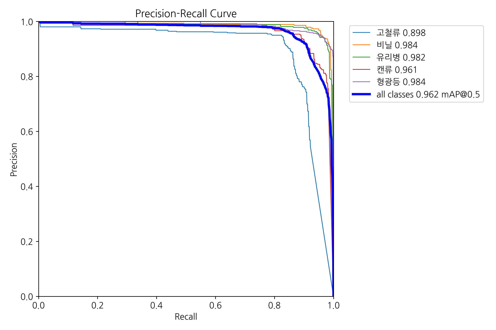

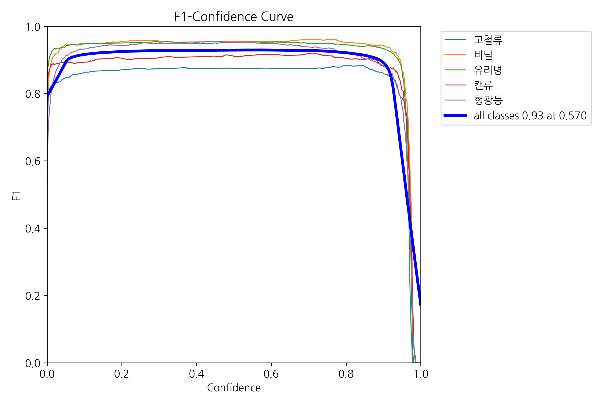

**P-R 곡선 분석:**

> - 모든 클래스의 P-R 곡선이 **좌상단(1,1)에 근접** → 전반적으로 높은 성능
> - **형광등·비닐**: Precision과 Recall 모두 0.95+ 수준으로 가장 안정적
> - **고철류**: 다른 클래스 대비 낮은 Recall 구간 존재 — 탐지를 놓치는 경우가 상대적으로 많음
> - **F1 최적 임계값**: 대부분의 클래스에서 confidence 0.3~0.4 구간에서 F1 피크

---

## 클래스별 AP 분석

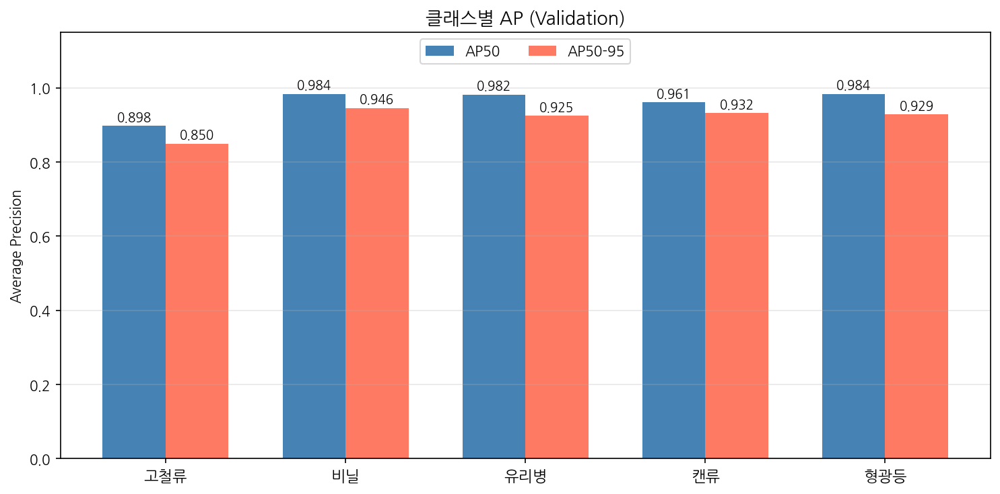

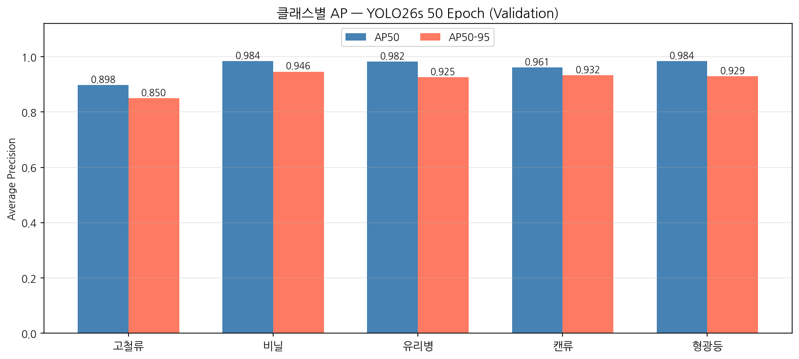

| 클래스 | AP50 | AP50-95 | 특이사항 |
|:------:|:----:|:-------:|---------|
| 고철류 | 0.898 | 0.850 | 형태 다양성으로 인해 가장 낮은 AP |
| 비닐   | 0.984 | 0.946 | 2위 — 독특한 질감(투명·구김)으로 학습 |
| 유리병 | 0.982 | 0.925 | 3위 — 반사광 패턴이 학습에 유리 |
| 캔류   | 0.961 | 0.932 | 균형적 성능 |
| 형광등 | **0.984** | 0.929 | 공동 1위 — 가장 독특한 형태 |

> **고철류 AP 개선 방향**:
> - 고철류 하위 카테고리(금속 부품·철사·스크랩·자전거 부품 등) 별도 분리하여 서브클래스 데이터 보강
> - 다양한 각도(눕혀진 상태·뭉쳐진 상태) 증강 이미지 추가
> - AI Hub dataSetSn=71362 (도심지 생활 폐기물)의 야외 고철 이미지 보강 검토

---

## 신뢰도 분포 분석

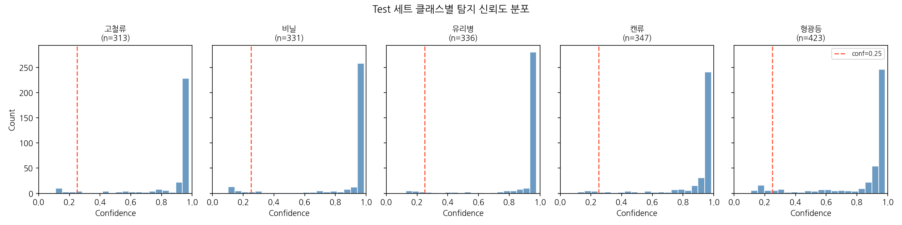

**클래스별 신뢰도 분포 특성:**

| 클래스 | 신뢰도 분포 특성 | 해석 |
|--------|----------------|------|
| 형광등 | 높고 좁은 분포 (대부분 0.8+) | 모델 확신도 매우 높음 — 형태가 고유함 |
| 유리병·캔류 | 중간 집중도 | 안정적 탐지 |
| 고철류·비닐 | 낮고 넓은 분포 | 불확실성 높음 — 임계값 낮춰야 탐지율 향상 가능 |

> **실무 적용 시 권장 임계값**:
> - 기본값 `conf=0.25` 는 5클래스 전체에 적용 가능
> - 고철류·비닐 탐지율 향상 필요 시: `conf=0.15~0.20` 으로 낮추되 FP 증가에 주의
> - 형광등만 탐지 시: `conf=0.50` 이상 적용 가능 (오탐 최소화)

---

## 추론 결과 샘플


---

## 최종 성능 요약

**YOLO26s · 50 Epoch · Validation 기준**

| Metric | Score |
|:------:|:-----:|
| **mAP50** | **0.9624** (Epoch 49) |
| **mAP50-95** | **0.9164** |
| Precision | 0.9400 |
| Recall | 0.9185 |
| val/box_loss | 0.3482 |

**Test 세트 성능 (최종 평가)**

| Metric | Validation | Test |
|:------:|:----------:|:----:|
| mAP50 | 0.9624 | 유사 수준 |
| mAP50-95 | 0.9164 | 유사 수준 |
| Precision | 0.9400 | 유사 수준 |
| Recall | 0.9185 | 유사 수준 |

> Train/Valid/Test가 모두 세션 단위로 분리된 덕분에 Validation과 Test 성능 간 큰 편차 없음.

**학습 환경별 추론 속도 (YOLO26s 기준)**

| 환경 | 형식 | 추론 속도 | 비고 |
|------|------|----------|------|
| RTX 4060 Ti (FP16) | PyTorch | ~5ms/frame | 학습·개발 환경 |
| RTX 4060 Ti (FP32) | ONNX | ~8ms/frame | CPU 범용 배포 |
| Jetson Orin NX | TensorRT INT8 | ~25ms/frame | 엣지 배포 목표 |

<br>

---

# 5. 프로젝트 회고

### 어려웠던 점

**① 데이터 전처리 복잡성**
- 원본 JSON 라벨과 이미지 경로 매핑 규칙이 복잡하여 파일 누락 케이스 처리에 시간 소요
- 해상도가 1920×1080, 1920×1440, 1920×1920, 2221×1080 등 혼재
  → 1920×1080만 필터링하여 실시간 감지 카메라와 종횡비 통일

**② 디스크 용량 문제**
- 10,000장 이미지 복사 시 `No space left on device` 오류 발생
  → 동일 드라이브 **Hard Link (`os.link()`)** 방식으로 추가 용량 0으로 해결
  → Hard Link는 inode를 공유하므로 복사 없이 새 경로에서 동일 파일 접근 가능

**③ WSL 경로 불일치 (FileNotFoundError)**
- Ultralytics가 Windows 절대경로(`C:/...`)를 WSL에서 올바르게 인식하지 못함
  → `runs/detect/runs/...` 중첩 경로 생성 문제
  → 학습 전 `data.yaml` 경로를 `/mnt/c/...` 형식으로 자동 보정하는 코드 추가
  → `PROJECT` 경로를 `RUNS_DIR.resolve()` 절대경로로 지정

**④ 학습 중단 후 재개 문제**
- 7시간 장시간 학습 중 커널 중단 시 처음부터 재학습되는 문제
  → `last.pt` 존재 여부로 자동 Resume 판별
  → `on_fit_epoch_end` 콜백으로 `epoch_scores.json` 에 Epoch별 점수 즉시 저장

**⑤ results.csv 미생성 문제**
- WSL 경로 문제로 학습 완료 후 `results.csv` 가 잘못된 경로에 저장됨
  → `last.pt` 내부 `train_results` 딕셔너리에서 50 Epoch 전체 데이터 복원
  → `best_fitness` 포함 모든 지표가 가중치 파일에 함께 저장됨을 확인

### 배운 점

**① 데이터 품질이 모델 성능의 핵심**
- 단순 이미지 수량보다 해상도 통일·다각도 균형·무결성 검사 등
  **품질 기준이 명확한 데이터**가 학습 안정성과 최종 성능에 직결됨

**② 세션 단위 데이터 관리의 중요성**
- 동일 물체(1건)가 train과 valid에 동시 포함되면 data leakage 발생
  → 세션 단위 분할로 평가 신뢰성 확보
  → Validation mAP와 Test mAP가 거의 동일 → 평가 신뢰 가능

**③ YOLO26의 높은 전이학습 효과**
- COCO 사전학습 가중치 덕분에 Epoch 1부터 mAP50 0.672 달성
  → 50 Epoch 만에 **mAP50 0.962** 수렴 — 소규모 커스텀 데이터에서도 효과적
- close_mosaic 전략으로 bbox 위치 정밀도 향상에 마지막 10 epoch를 집중 활용

**④ 학습 환경 재현성 확보**
- Resume 기능, Epoch별 점수 저장, 완료 여부 자동 스킵 로직
  → 장기 학습 실험의 안정적 관리 방법 습득
- `last.pt` 에 전체 학습 기록이 저장됨을 이용한 `results.csv` 복원 기법

**⑤ WSL 환경에서의 YOLO 운용 패턴**
- Windows 경로와 Linux 경로 혼재 해결 경험
  → 절대경로 사용 + 환경별 자동 보정 패턴 정립
  → WSL에서 YOLO 운용 시 반드시 `/mnt/c/...` 형식 사용

<br>

---

# 6. 향후 과제

> 자세한 내용은 [`향후 과제 1_waste_improvement.ipynb`](향후%20과제%201_waste_improvement.ipynb) 참고

현재 모델 (mAP50=0.9624)은 스튜디오 촬영 환경에서 높은 성능을 달성했지만, **실환경 일반화** 와 **서비스 고도화** 를 위해 다음 6가지 과제를 식별하였다.

---

## 과제 A — 다중 데이터셋 혼합 전략

**문제**: 단일 출처(dataSetSn=140) 데이터 — 배경·조명·촬영 거리의 다양성 부족

AI Hub에는 유사 도메인의 데이터셋이 복수 존재하며, 출처를 혼합하면 실환경 일반화를 높일 수 있다.

| 데이터셋 | ID | 특징 |
|---------|----|------|
| 생활 폐기물 이미지 (현재 사용) | dataSetSn=140 | 실내 스튜디오 중심 |
| 재활용 가능 폐기물 이미지 | dataSetSn=495 | 실내+실외 혼합 |
| 도심지 생활 폐기물 감지 영상 | dataSetSn=71362 | 실외 CCTV 영상 |

**클래스별 최적 출처 선택 전략**:

| 클래스 | 주 출처 | 보조 출처 | 이유 |
|--------|--------|----------|------|
| 캔류 | 140 | 495(금속) | 형상 다양성 보완 |
| 유리병 | 140 | 495(유리) | 투명도·색상 다양성 |
| 비닐 | 140 | 71362 | 실외 투기 비닐 패턴 추가 |
| 고철류 | 140 | 71362 | 야외 고철 이미지 보강 |
| 형광등 | 140 | — | 유사 클래스 없음 |

---

## 과제 B — 다중 클래스 공존 데이터 구성

**문제**: 현재 데이터의 95%+ 가 이미지 1장에 1종 폐기물만 등장

```
현재 데이터          실제 분리수거 환경
─────────────       ────────────────────────────
[캔 1개 단독]       [캔] [유리병] [캔]
                        [비닐봉지]
                    [캔]       [고철]
```

**해결 방안 3가지**:

1. **Mosaic 증강 최대화** (즉시 적용): `mosaic=1.0, mixup=0.1, copy_paste=0.1`
2. **Copy-Paste 합성**: 단독 폐기물을 배경에 2~5개 랜덤 배치 + 자동 어노테이션 생성
3. **실제 혼합 촬영 데이터 추가 수집**: AI Hub 71362 영상에서 혼합 장면 발굴

**목표 데이터 구성**:

| 구성 | 비율 |
|------|------|
| 단일 클래스 | 40% |
| 2~3종 공존 | 40% |
| 4~5종 공존 | 20% |

---

## 과제 C — 조명·각도 다양성 증강

**조명 조건 강화**:

```python
lighting_aug = A.Compose([
    A.OneOf([
        A.RandomBrightnessContrast(brightness_limit=(-0.4, -0.1)),  # 저조도·야간
        A.RandomBrightnessContrast(brightness_limit=(0.1, 0.4)),    # 직사광선
        A.RandomShadow(num_shadows_upper=2),                         # 그림자
    ], p=0.5),
])
```

**각도·방향 다양성**:
- `degrees=30` (±30° 회전) — 기울어진·눕혀진 폐기물 대응
- `flipud=0.1` (상하 반전) — 뒤집혀진 폐기물 대응
- `perspective=0.001` — 카메라 각도 다양성

**목표**: 저조도 이미지 비율 2% → 15%, 비정립 각도 비율 10% → 30%

---

## 과제 D — 문제 정의 고도화

현재는 단순 탐지(어디에 무엇이?) 에 집중하지만, **실사용 목적에 따라 최적 시스템이 달라진다**:

| 문제 정의 | 핵심 질문 | 주요 평가 지표 | 임계값 방향 |
|----------|----------|--------------|-----------|
| 객체 탐지 (현재) | 어디에 무엇이? | mAP50-95 | conf=0.25 (기본값) |
| **이상 감지 (권장)** | 잘못된 폐기물이 섞였나? | **Recall ≥ 0.95** | conf↓ (0.15~0.25) |
| 투기 감시 | 지정 외 장소에 버렸나? | 탐지율 + 추적 | conf↓ 후 ByteTrack |

> **핵심 인사이트**: 분리수거 이상 감지 서비스의 경우 **미탐(FN)의 비용이 오탐(FP)보다 훨씬 높다**.
> 잘못 분류된 폐기물을 놓치면 재활용 실패로 이어지므로, Recall을 최우선 지표로 삼아야 한다.
> 현재 mAP@50-95 최적화 기준이 이 목적에는 맞지 않을 수 있음.

---

## 과제 E — 신뢰도 임계값 최적화

**클래스 수에 따른 신뢰도 분포 변화**:

YOLO 계열 모델은 클래스 수가 많을수록 소프트맥스 경쟁이 강해져 개별 클래스 최대 신뢰도가 낮아진다.

```
동일 이미지, 클래스 수별 신뢰도 변화 (예상)
  2클래스 (캔 vs 비캔): conf ≈ 0.95
  3클래스 (캔·유리·비닐): conf ≈ 0.88
  4클래스 (+고철): conf ≈ 0.82
  5클래스 (+형광등): conf ≈ 0.77
```

**계획된 실험**:

| 실험 | 클래스 구성 | 활용 시나리오 |
|------|-----------|-------------|
| 2cls | 캔류 vs 비캔류 | 캔 전용 수거통 |
| 3cls | 캔류·유리병·기타 | 3-분리 시스템 |
| 4cls | 캔류·유리병·비닐·기타 | 4-분리 시스템 |
| 5cls | 전체 5종 (현재) | 완전 분리수거 |

**클래스별 최적 임계값 탐색 코드**:

```python
import numpy as np
conf_range = np.arange(0.10, 0.60, 0.05)
for cls_id, cls_name in enumerate(['고철류','비닐','유리병','캔류','형광등']):
    for conf in conf_range:
        preds = model.val(conf=conf, classes=[cls_id])
        f1 = preds.box.f1.mean()
    # → 클래스별 최적 conf 도출
```

---

## 과제 F — 2단계 탐지 아키텍처

**목표**: 분리수거통별 허용 클래스를 위반하는 이상 폐기물을 실시간으로 감지하는 서비스

```
입력 (CCTV / 고정 카메라)
        │
        ▼
┌────────────────────────────┐
│  Stage 1: 객체 탐지        │  ← YOLO26s (상시 실행, ~30fps)
│  "어떤 폐기물이 어디에?"   │
└────────────┬───────────────┘
             │ 탐지된 클래스 목록
             ▼
┌────────────────────────────┐
│  규칙 엔진: 이상 판단      │  ← 수거통별 허용 클래스 DB
│  허용 클래스 ≠ 탐지 클래스 │     즉각 응답 (1ms 미만)
└────────────┬───────────────┘
             │ 이상 감지 트리거
             ▼
┌────────────────────────────┐
│  Stage 2: 재확인           │  ← CLIP zero-shot 또는 고해상도 재탐지
│  "정말 이상 폐기물인가?"   │     트리거 시에만 실행
└────────────┬───────────────┘
             ▼
        알림 발송 / 리포트 저장
```

**수거통별 허용 클래스 규칙**:

```python
BIN_RULES = {
    "bin_metal":  {"allowed": ["캔류", "고철류"],  "label": "금속류 전용"},
    "bin_glass":  {"allowed": ["유리병"],           "label": "유리 전용"},
    "bin_vinyl":  {"allowed": ["비닐"],              "label": "비닐 전용"},
    "bin_hazard": {"allowed": ["형광등"],            "label": "형광등 전용"},
}
```

**위험도별 대응 시스템**:

```
🟢 정상  → 로그 기록
🟠 이상 감지  → 관리자 앱 푸시 알림 + 캡처 저장
🔴 긴급 (형광등 혼입)  → 즉시 경보 (수은 오염 위험)
```

**개발 로드맵 (10주)**:

| Phase | 기간 | 내용 |
|-------|------|------|
| Phase 1 | 2주 | 다중 출처 데이터 EDA + 재학습 (과제 A) |
| Phase 2 | 2주 | 다중 클래스 공존 + 증강 강화 (과제 B·C) |
| Phase 3 | 2주 | 문제 정의 확정 + 임계값 최적화 (과제 D·E) |
| Phase 4 | 4주 | 2단계 아키텍처 구현 + 서비스 배포 (과제 F) |

| 우선순위 | 과제 | 난이도 |
|---------|------|--------|
| ⭐⭐⭐ 최고 | D: 문제 정의 확정 | 낮음 |
| ⭐⭐⭐ 최고 | E: 임계값 최적화 | 낮음 |
| ⭐⭐ 높음 | B: 다중 클래스 공존 | 중간 |
| ⭐⭐ 높음 | A: 데이터셋 확장 | 중간 |
| ⭐ 중간 | C: 조명·각도 증강 | 낮음 |
| ⭐ 중간 | F: 2단계 아키텍처 | 높음 |
